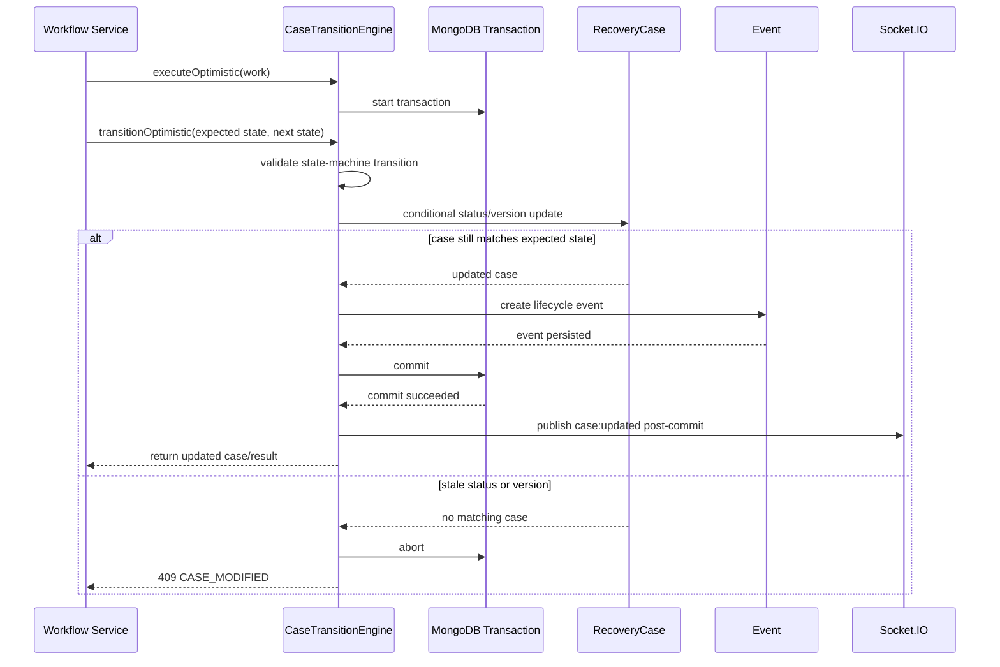

# CaseTransitionEngine Architecture

## 1. Purpose

`CaseTransitionEngine` is the single coordination boundary for reliable `RecoveryCase` lifecycle transitions. It exists so workflow services can make a state change without reimplementing concurrency control, event persistence, version management, or post-commit real-time publication.

Workflow services remain responsible for deciding **whether** a business action is allowed. The engine is responsible for applying the resulting lifecycle transition safely and consistently.

The engine currently supports both:

- `transitionOptimistic()`, the required path for new workflow migrations.
- `transition()`, a temporary legacy compatibility path for workflows that have not yet migrated. It must not be used for new migrations and should be removed when migration is complete.

## 2. Problems It Solves

### Race conditions

Two requests can read the same case state and both conclude that an action is valid. Without concurrency control, both could write competing results and create contradictory workflow records. The optimistic transition checks that the case still has the status and version observed by the caller.

### Optimistic locking

The engine uses `RecoveryCase.version` as a concurrency token. A transition succeeds only when the stored status and version still match the workflow service's expectations. A stale command is rejected instead of silently overwriting newer work.

### Atomic state transitions

The conditional `RecoveryCase` update and its corresponding `Event` are executed in the same MongoDB transaction. If either operation fails, the transaction is aborted and neither change survives.

### Event consistency

The engine creates the lifecycle `Event` only after the conditional case update succeeds. This prevents events for rejected transitions and keeps the persisted timeline aligned with case state.

## 3. Responsibilities

The `CaseTransitionEngine` is responsible for:

- Starting a MongoDB transaction for a command, or providing the session used by the command.
- Validating the requested lifecycle transition through the existing case state machine.
- Applying an optimistic `RecoveryCase` update using the expected status and version.
- Incrementing `RecoveryCase.version` atomically with the status change.
- Applying validated, non-protected fields supplied through `casePatch`.
- Creating the corresponding lifecycle `Event` in the same transaction.
- Registering post-commit actions.
- Running post-commit actions only after a successful commit.
- Logging and isolating post-commit failures so an already committed HTTP command is not reported as failed.

The canonical optimistic API is:

```js
await CaseTransitionEngine.executeOptimistic({
  work: async ({ session, afterCommit }) => {
    const updatedCase = await CaseTransitionEngine.transitionOptimistic({
      caseId,
      expectedStatus,
      expectedVersion,
      nextStatus,
      actor: {
        id: actorId,
        role: actorRole,
      },
      casePatch,
      metadata,
      session,
    });

    return updatedCase;
  },
});
```

`casePatch` cannot contain lifecycle or persistence-owned fields such as `_id`, `status`, `version`, `__v`, or timestamps.

## 4. Responsibilities Intentionally Excluded

The engine intentionally does not own:

- Workflow-specific business validation.
- Loading or validating pickups, inspections, facilities, decisions, refunds, or users.
- Creating or updating workflow-specific documents.
- Custody transfer logic.
- Persistent notification creation or recipient selection.
- Email, push, or other notification delivery.
- BullMQ job production or processing.
- Outbox persistence or dispatch.
- HTTP controllers, response shapes, or UI concerns.

These responsibilities stay in workflow services or dedicated infrastructure. Keeping this boundary narrow prevents the engine from becoming a general-purpose workflow framework.

## 5. Transition Lifecycle



Socket.IO publication is deliberately outside the transaction. A socket callback failure is logged after commit and does not convert a successfully committed command into an HTTP failure.

## 6. Optimistic Locking

### `expectedStatus`

The workflow service captures the case status on which its business validation was based. Including it in the update condition prevents a command from acting on a case that has already moved elsewhere in the lifecycle.

### `expectedVersion`

The workflow service also captures `RecoveryCase.version`. This detects a concurrent case modification even when status alone would not reveal it.

### Conditional update

The engine updates the case using a condition equivalent to:

```js
{
  _id: caseId,
  status: expectedStatus,
  version: expectedVersion,
}
```

The atomic update applies the next status and permitted `casePatch` fields while incrementing the version:

```js
{
  $set: { ...casePatch, status: nextStatus },
  $inc: { version: 1 },
}
```

### Version increment

Every successful transition increments `version` in the same database operation as the status update. Any other request holding the old version immediately becomes stale.

### `409 Conflict`

If the conditional update finds no matching document, the case changed after it was read. The engine aborts the transaction and returns:

```json
{
  "success": false,
  "code": "CASE_MODIFIED",
  "message": "The case was modified by another request. Refresh and try again."
}
```

There is no automatic retry. The client must refresh and submit a new command based on current state.

## 7. Current Migrated Workflows

The following workflow commands currently use the optimistic transition path:

1. **Assign Inspector**
   - Captures the current status and version.
   - Creates the `Inspection` within the transaction.
   - Transitions the case to `INSPECTION_ASSIGNED` and patches `inspectionId`.
   - A losing concurrent assignment is rolled back, so no duplicate inspection survives.

2. **Pickup Assignment**
   - Captures the current status and version.
   - Preallocates the pickup identifier.
   - Transitions the case to `PICKUP_ASSIGNED` and patches the pickup, facility, and ownership fields.
   - Creates the `Pickup` in the same transaction.
   - A stale concurrent assignment receives `CASE_MODIFIED`, and its transaction does not leave a pickup behind.

Other workflow transitions still use the explicitly legacy non-optimistic compatibility path until they are migrated.

## 8. Future Migration Order

Recommended migration order:

1. **Refund Approval** - protects the approval boundary from duplicate administrative commands.
2. **Refund Recording** - protects ledger creation and case completion from duplicate financial obligations.
3. **Remaining workflows** - pickup accept/collect/deliver/fail, facility receive, inspection start/complete, decision review/decide, and any remaining lifecycle commands.

Each migration should preserve its existing transaction coverage, move all `RecoveryCase` lifecycle fields into `casePatch`, keep workflow-document writes in the service, and verify concurrent requests produce one success and one `409 CASE_MODIFIED` where applicable.

## 9. Future Roadmap

### Idempotency

An idempotency layer can sit at the command boundary before transaction execution. It should identify repeated client commands and return the previously committed result. Optimistic locking remains necessary because it protects against distinct competing commands, not just retries of the same command.

### Immutable audit trail

The existing transactional `Event` creation is the foundation for an immutable audit trail. A future phase should enforce append-only event storage, define stable event schemas, and add correlation or command identifiers without allowing historical events to be edited.

### Outbox

Socket and asynchronous delivery guarantees eventually require a transactional Outbox record created alongside the case and event. A dispatcher can publish committed outbox messages and mark them delivered. This closes the reliability gap between a successful database commit and a process failure before post-commit publication.

### BullMQ

BullMQ can later consume work dispatched from the Outbox for retries, notifications, integrations, and other asynchronous side effects. The transition engine should register durable intent through the Outbox rather than know about queues or job types directly.

The intended long-term boundary remains unchanged: workflow services decide the business action, the `CaseTransitionEngine` commits the lifecycle change and durable facts, and asynchronous infrastructure delivers resulting side effects.
