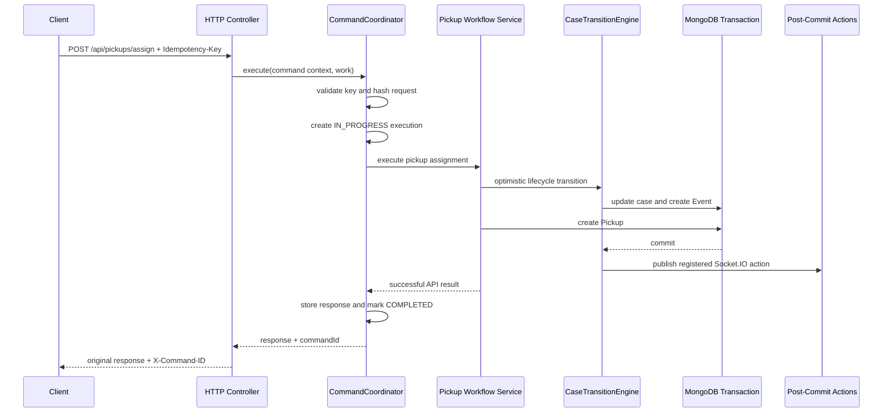

# Command Coordinator Architecture

## Purpose

The `CommandCoordinator` provides request-level idempotency for critical HTTP commands. It prevents client retries, double-clicks, proxy retries, and concurrent duplicate requests from executing the same workflow more than once.

Optimistic locking and idempotency solve different problems. Optimistic locking rejects competing lifecycle updates based on stale case state. Idempotency recognizes repeated delivery of the same client command and replays its original successful response.

V1 is integrated only with `POST /api/pickups/assign`.

## Why It Is Outside CaseTransitionEngine

`CaseTransitionEngine` is a domain lifecycle component. It validates case transitions, performs the optimistic `RecoveryCase` update, increments the version, creates the lifecycle `Event`, and registers post-commit actions.

The coordinator is an HTTP command boundary. It understands:

- `Idempotency-Key` headers.
- HTTP method and canonical route.
- Request hashing.
- Stored HTTP status and response bodies.
- Response replay.

Keeping these concerns separate prevents HTTP transport details from leaking into the case lifecycle engine. Workflow services remain responsible for business validation and workflow-specific records.

## Execution Sequence



## Request Identity

The coordinator hashes a canonical representation of:

- HTTP method.
- Canonical route.
- Route parameters.
- Request body.
- Authenticated user ID.

Object keys are sorted recursively before hashing. Array order and JSON value types are preserved.

Execution ownership is uniquely scoped by:

```text
userId + method + route + Idempotency-Key
```

## Replay Behavior

### First request

The coordinator creates an `IN_PROGRESS` record, invokes the workflow once, stores the successful response, marks the execution `COMPLETED`, and returns `X-Command-ID`.

### Duplicate while in progress

The coordinator returns `409 IDEMPOTENCY_IN_PROGRESS`. It does not run the workflow.

### Duplicate after completion

The coordinator returns the stored HTTP status and body, with:

```http
Idempotency-Replayed: true
X-Command-ID: <original-command-id>
```

It does not recreate the Pickup, Event, notification, or socket action.

### Same key with a different request

The coordinator returns `422 IDEMPOTENCY_KEY_REUSED` and does not replay or execute the request.

### Workflow failure

V1 does not store failed responses. It removes the `IN_PROGRESS` record so a later request with the same key can execute again.

## CommandExecution Storage

`CommandExecution` stores the command UUID, idempotency scope, request hash, execution status, response snapshot, lock expiry, retention expiry, and timestamps.

The collection has:

- A unique index on `{ userId, method, route, key }`.
- A TTL index on `expiresAt`.
- An operational index on `{ status, lockedUntil }`.

V1 supports only `IN_PROGRESS` and `COMPLETED`.

## V1 Reliability Boundary

The workflow transaction commits before the coordinator stores the completed HTTP response. A process crash in that narrow interval can leave committed business state with an `IN_PROGRESS` command record. V1 intentionally does not add distributed recovery, automatic retries, or an Outbox. This limitation must be closed in a later phase before treating command replay as an end-to-end delivery guarantee.

`lockedUntil` records the ownership lease but V1 does not automatically steal or retry expired commands.

## Future Integration

### Immutable audit trail

The `commandId` can later be attached to lifecycle Events to correlate the initiating HTTP command with immutable domain history. V1 establishes the identifier without changing Event schemas.

### Outbox

The eventual design should persist the completed command result and Outbox messages atomically with workflow state. This closes the crash window between transaction commit and asynchronous publication.

### BullMQ

After Outbox persistence exists, dispatchers can enqueue durable notification and integration jobs in BullMQ. Queue job IDs should derive from durable Outbox IDs for worker-level deduplication.

### Distributed workers

The unique MongoDB ownership index already coordinates multiple API instances for the same key. Future workers will need expired-lock recovery, heartbeat or lease rules for long commands, and reconciliation for unknown commit outcomes. Those mechanisms are deliberately outside V1.
